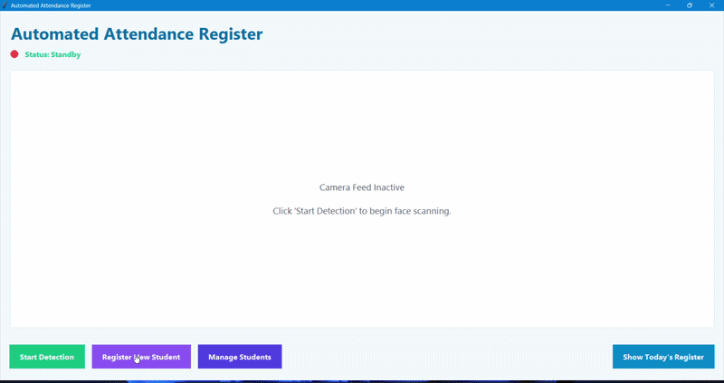
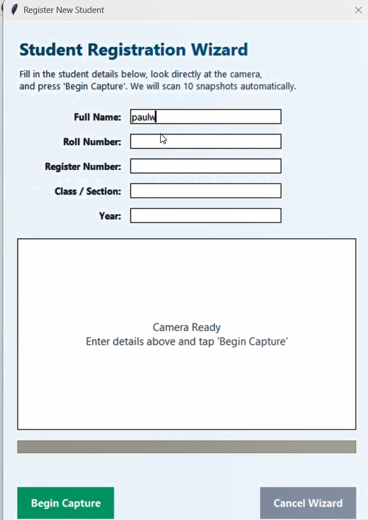
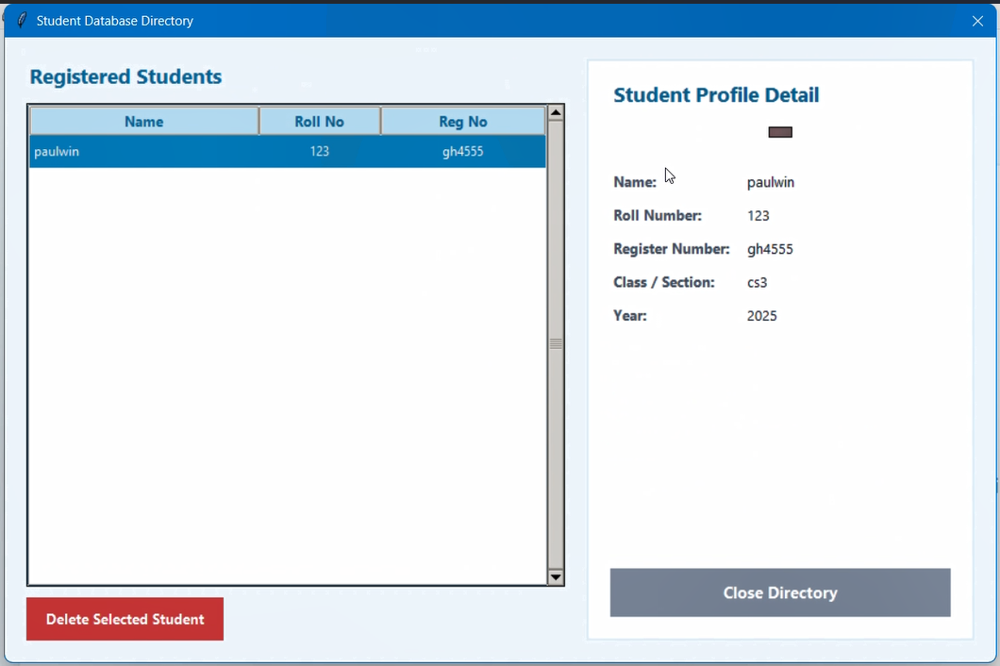
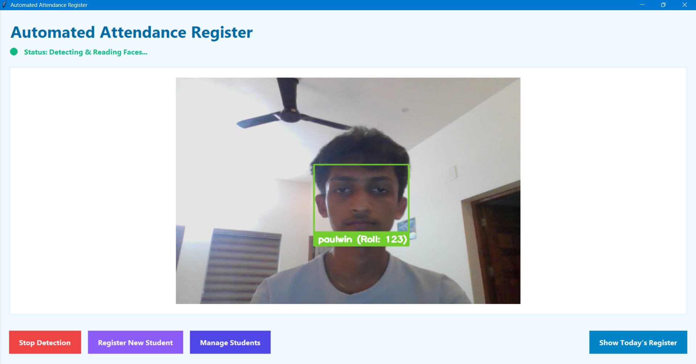
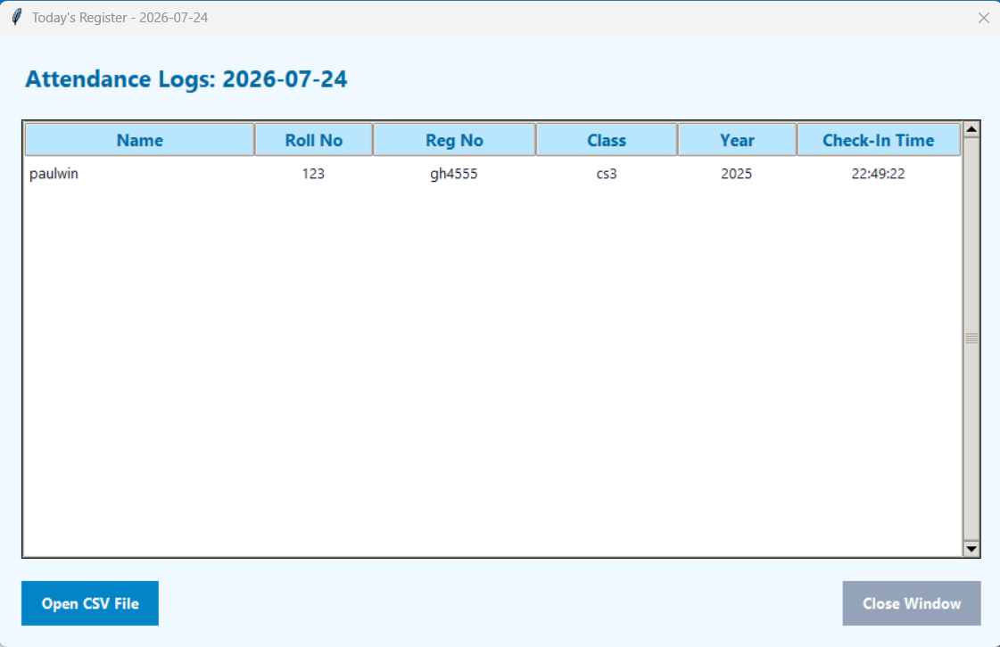
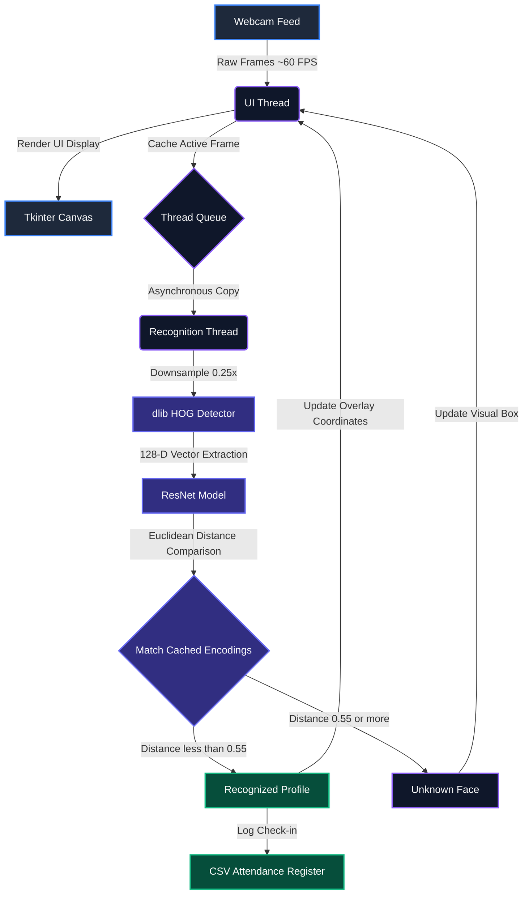

# AetherAttend
# 📸 AetherAttend: Deep Learning Face Recognition Attendance System

<div align="center">


*A high-performance, multi-threaded desktop attendance system utilizing dlib's state-of-the-art deep learning face recognition models and OpenCV.*

[Features](#-key-features--technical-innovations) • [Architecture](#-system-architecture--data-flow) • [Installation](#-installation--setup) • [Dependencies](#-libraries--external-repositories)

</div>

---

## 🖼️ Application Preview

> **Interface Design:** Built with a modern slate-blue Tkinter theme, featuring real-time bounding box overlays, active frame statistics, and an administrative control panel.

<div align="center">
  
  <p><i>Real-time 60 FPS face recognition and bounding box overlays</i></p>
</div>

### System Screenshots
| MAIN SCREEN | VERIFICATION SCREEN| REGISTRATION WIZARD| REGISTERED DATA | LIVE PREVIEW | ATTENDANCE LOG|
| :---: | :---: |  :---: |  :---: |  :---: |  :---: |
|  |  | | | | | |
---

## 🚀 Key Features & Technical Innovations

### 1. High-Speed Decoupled Multi-Threading (~60 FPS)
Normally, running deep learning face recognition directly inside a video display loop causes severe frame freezing. **AetherAttend resolves this using a decoupled dual-thread architecture**:
* **Camera Feed Worker Thread**: Continuously captures webcam frames and renders them to the Tkinter canvas, maintaining a fluid **60 FPS stream**.
* **Recognition Processor Thread**: Runs asynchronously in the background. It grabs active frames, resizes them to 0.25x for rapid CPU computation, detects bounding boxes, extracts 128-D face embeddings, and updates UI overlays without blocking the interface.

### 2. Multi-Angle Enrollment Wizard (Pose Validation Filter)
To ensure high recognition accuracy across head tilts and rotations, students enroll with **10 distinct photo snapshots**.
* During registration, the wizard automatically captures snapshots when a face is detected.
* It calculates the Euclidean distance (`face_distance`) between the current face vector and previously accepted poses.
* **If the Euclidean distance is less than 0.28 (duplicate angle), the wizard rejects the frame** and prompts: `"Same angle! Rotate head slightly"`.
* This guarantees 10 mathematically distinct angles for maximum classifier precision.

### 3. Secure Admin Gateway & Student Directory Explorer
* **Role-Based Security**: Administrative actions (registering new students, deleting records) require password verification (`default: admin123`).
* **Visual Directory Manager**: A split-pane directory with an interactive Treeview list and robust lookup handlers.
* **Dynamic Photo Preview**: Automatically loads and resizes reference face snapshots (`1.jpg`) using PIL when a profile is selected.
* **Recursive Clean Deletion**: Safely removes JSON student metadata, recursively deletes image dataset directories (`shutil.rmtree`), and flushes the in-memory cache instantly.

---

## 📐 System Architecture & Data Flow



---

## 🛠️ Installation & Setup

### Prerequisites
* **Python 3.10 or higher**
* **C++ Build Tools** *(required for compiling dlib)*:
  * **Windows**: [Visual Studio C++ Build Tools](https://visualstudio.microsoft.com/visual-cpp-build-tools/)
  * **Linux/macOS**: `gcc` / `g++` and `cmake`

### Step-by-Step Setup

1. **Clone the repository:**
   ```Bash
   git clone https://github.com/PaulwinTP/AetherAttend.git
   cd AetherAttend


2. **Install dependencies:**

  ```Bash
pip install -r requirements.txt
 ```
3. **Launch the Application:**

 ```Bash
python main.py
 ```
***Default Admin Credentials: admin123***
 

---

## 📚 Libraries & External Repositories Used

This project stands on the shoulders of incredible open-source tools and deep learning libraries:

| Library / Repository | Description | Usage in AetherAttend |
| :--- | :--- | :--- |
| **[dlib](https://github.com/davisking/dlib)** | Modern C++ toolkit containing machine learning algorithms. | Provides the core HOG face detector and the pretrained ResNet model for generating 128-dimensional facial vector embeddings. |
| **[face_recognition](https://github.com/ageitgey/face_recognition)** | Python wrapper for `dlib`'s face recognition tools. | Simplifies matrix distance measurements and bounding box localization. |
| **[OpenCV](https://github.com/opencv/opencv)** | Open Source Computer Vision Library. | Handles high-speed camera frame capturing, color format conversions (BGR to RGB), and visual overlay rendering. |
| **[Pillow (PIL)](https://python-pillow.org/)** | Python Imaging Library. | Manages dynamic image resizing and preview loading inside the Tkinter canvas UI. |

📄 License
Distributed under the MIT License. See LICENSE for more information.

---

## 🎓 Academic Context & Author

<div align="center">

### **Paulwin TP**
*B.Tech Student | Developer & Computer Vision Enthusiast*

[](https://github.com/PaulwinTP)
[](https://www.linkedin.com/in/paulwin-t-p)

---

### 🏛️ Project Credits
* **Course / Subject:** S2 B.Tech — IPR (Innovation & Project Realization) Course Project
* **Project Name:** AetherAttend — Deep Learning Face Recognition Attendance System
* **Core Focus:** Real-time multi-threading, deep learning embeddings, and automated tracking.

</div>

